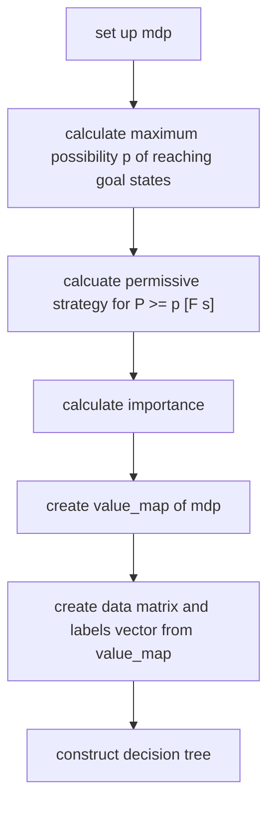
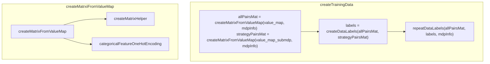

# Developer Guide
This guide contains the necessary information to extend or customize countexex to suit your specific needs.

## Overview
In this section, we provide an overview of the software architecture of the tool.
The following is a schematic overview of the folder structure of our project.
```
├── app
│   ├── main.cpp
├── CMakeLists.txt
├── doc
├── examples
├── LICENSE
├── README.md
├── src
│   ├── dtree_visualization
│   ├── importance_calculation
│   ├── model_builder
│   ├── train_data_generation
├── tests

```

The folder app contains the main.cpp file.
In the main.cpp file, the function pipeline is the main process. 
Each folder in src contains a header and a cpp file.
These contain library functions that get used by the pipeline.

### Important Data Structures
#### value_map
```cpp
typedef std::map<std::string, std::variant<std::vector<int>, std::vector<bool>>> ValueMap;
ValueMap value_map
```
This data structure is our representation of the state-action pairs. 
It is a map from a string that is either 
1. the name of a variable (or dimension in mlpack)
2. "action"
3. "imps"

to a vector of values. 
The Cartesian product of the n-th entry of the vectors for every key and "action" constitutes a state-action pair.
We further add the vector imps which is the ID of the state, so that we can later repeat this state-action pair as often as needed.
#### data
```cpp
arma::fmat data
```
This contains the state-action pairs in matrix format. 
As arma is column-major, mlpack treats each column as a data point and each row as a dimension.
The first row will contain the state ID, then the following rows are a one-hot encoding of the actions. 
The actions are one-hot encoded because, for categorical features, the decision tree isn't necessarily binary.
We will have repeated each state-action pair as often as indicated by the importance vector.

#### model ValueType
The ValueType of the model is restricted to double, as the permissive strategy computation expects this ValueType. Thus, the types *storm::RationalNumber* and *storm::RationalFunction* are currently not supported.

#### storm engine
We are restricted to using Storm's [sparse engine](https://www.stormchecker.org/documentation/background/engines.html), as the permissive strategy computation expects a model of type *storm::models::sparse::Mdp<double, RM>*.


### main.cpp
The following flowchart gives a high-level overview of the pipeline process. We will further explain the individual steps in the following.

After setting up the model of type storm::models::sparse::Mdp<double>, we calculate the maximum possible probability of reaching our goal states, because for calculating a permissive strategy, we need a formula of the form P >= p [F s].

After this, we calculate the importance using calculateImps from importance_calculation/impCalc.cpp.

Then, the pipeline calls createStateActionPairs from genTrainData.cpp to convert the state-actions pairs of the MDP into the value_map.
Finally, the function createTrainingData in genTrainData.cpp converts this value map into a matrix and label pair that we can use as input for the decision tree.

### genTrainData.cpp
In this section, we will give an overview of the relationship between the functions in genTrainData.cpp.
The purpose of these functions is as helpers for the createTrainingData.cpp function.
#### 



## CMake structure
We have included mlpack as an ExternalProject because we need the feature of accessing the ClassProbabilities vector to visualize the tree.
This feature is already in the master, however not yet in most common distributions.

Furthermore, we have added storm as a submodule to our git project and use the CMake library that it creates directly because we have modified the calculation of the strategy.

Lastly, we use Catch2 to unit test our project.

## Extending countexex
### Supporting new objectives
Currently, only reachability objectives are supported. Supporting different objectives requires further changes. The importance computation has to be adapted to the new objective as well as the permissive strategy computation, as it expects as input an “eventually” formula.

### Supporting new input types
At the moment, the tool supports only PRISM input files. In order to expand this support to other formats, such as Jani input files, the function *buildModelFormulas* in *src/model_builder/* has to be changed. In particular, instead of the current call to *parseProgram()*, which is tailored for parsing PRISM programs, we would need to call different parse functions depending on the input file format e.g., *parseJaniModel()*. Additionally, it has to be checked, which variable types the new format supports. As PRISM only handles integer and boolean variables, the tool only supports those data types. Thus, the function *createStateActPairs* in *src/train_data_generation/* and the *ValueMap* have to be extended to support additional data types.

### Supporing parametric model checking
Here again, the permissive strategy computation is the limiting factor, as it expects an MDP of value type *double*, while a parametric model has type *storm::RationalFunction*.

### Soft learning option for multiple-action states vs. single-action states
As we allow a state to be coupled with multiple actions in the liberal strategy, there might be states for which only one action is included, while for others multiple actions are included. Thus, in the learning, there might be more emphasis on states that have multiple actions. In order to compensate for that, states with only a single action could be repeated c-times in the training-data, where c is a constant.

### Permissive strategy computation
Currently, the computation of the permissive strategy is a performance bottleneck for the tool. For large models, such as the Zeroconf Protocol with approximately 300 thousand states, the computation does not complete even after running for 6 hours. Storm offers two implementations: one using Mixed Integer Linear Programming (MILP) and the other using Satisfiability Modulo Theories (SMT). However, neither of these approaches has completed within a reasonable timeframe. Therefore, it may be worth considering an alternative implementation for computing the liberal strategy.

### Categorical data type handling
By default, mlpack's decision tree learning employs the 'AllCategoricalSplit' split type for categorical data types. This split type creates a separate child node for each category. The categories represent the actions, which in turn represent the commands from the PRISM file. As the amount of actions can grow very large, we did not want to force one child for each category. Therefore, we use a one-hot-encoding, to treat each category as a numeric feature. As this in turn can lead to cascades of actions within the tree, one might consider an intermediate solution. Therefore, a new split type class would have to be implemented in mlpack replacing the default "AllCategoricalSplit", providing the desired splitting behavior.
