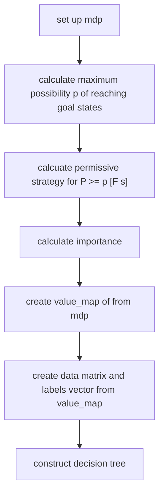
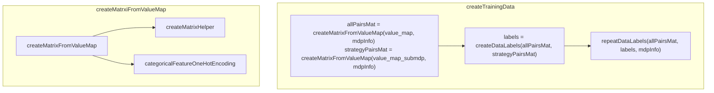

# Developer Guide
This guide contains the necessary information to extend or customize countexex to suit your specific needs.

## Overview
In this section, we provide an overview of the software architecture of the tool.
The following is a schematic overview of the folder structure of our project.
```
├── app
│   ├── main.cpp
├── CMakeLists.txt
├── doc
├── examples
├── LICENSE
├── README.md
├── src
│   ├── dtree_visualization
│   ├── importance_calculation
│   ├── model_builder
│   ├── train_data_generation
├── tests

```

The folder app contains the main.cpp file.
In the main.cpp file, the function pipeline is the main process. 
Each folder in src contains a header and a cpp file.
This contains library functions that get used by the pipeline.

### Important Data Structures
#### value_map
```cpp
typedef std::map<std::string, std::variant<std::vector<int>, std::vector<bool>>> ValueMap;
ValueMap value_map
```
This data structure is our representation of the state-action pairs. 
it is a map from a string that is either 
1. the name of a variable (or dimension in mlpack)
2. "action"
3. "imps"

to a vector of values. 
The cartesian product of the n-th entry of the vectors for every key and "action" constitutes a state-action pair.
We further add the vector imps which is the id of the state, so that we can later repeat this state-action pair as often as needed.
#### data
```cpp
arma::fmat data
```
This contains the state-action pairs in matrix format. 
As arma is column-major, mlpack treats each column as a data point and each row as a dimension.
The first row will contain the state id, then the following rows are a one-hot encoding of the actions. 
The actions are one-hot encoded because, for categorical features, the decision tree isn't necessarily binary.
We will have repeated each state-action pair as often as indicated by the importance vector.


### main.cpp
The following flowchart gives a high-level overview of the pipeline process. We will further explain the individual steps in the following.

After setting up the model of type storm::models::sparse::Mdp<double>, we calculate the maximum possible probability of reaching our goal states, because for calculating a permissive strategy, for need a formula of the form P >= p [F s].

After this, we calculate the importance using calculateImps from importance_calculation/impCalc.cpp.

Then the pipeline calls createStateActionPairs from genTrainData.cpp to convert the state-actions pairs of the MDP into the value_map.
Finally the function createTrainingData in genTrainData.cpp converts this value map into a matrix and label pair that we can use as input for the decision tree.

### genTrainData.cpp
In this section, we will give an overview of the relationship between the functions in genTrainData.cpp.
The purpose of these functions is as helpers for the createTrainingData.cpp function.
#### 



## CMake structure
We have included mlpack as an ExternalProject because we need the feature of accessing the ClassProbabilities vector to visualise the tree.
This feature is already in the master however not yet in most common distributions.

Furthermore, we have added storm as a submodule to our git project and use the cmake library that it creates directly because we have modified the calculation of the strategy.

Lastly, we use Catch2 to unit test our project.
## Setup
In order to be able to debug the system set the option *STORM_DEVELOPER* to *ON* in **/countexex/storm/CMakeLists.txt**
## Extending countexex
### Supporting New Objectives
Currently, only reachability objectives are supported ...