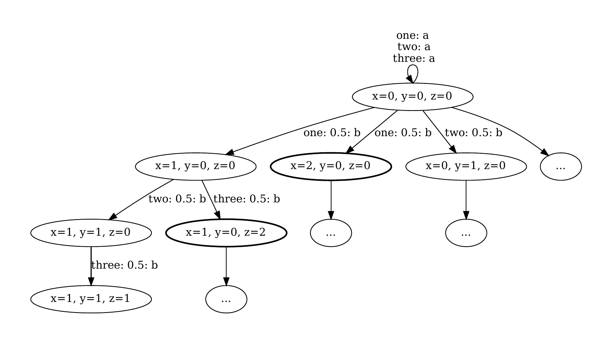

# Examples 

## 1. Cycle
At first, we take a look at the file cycle.nm, which can be found in this folder. The mdp model file consists of three modules. Each module manipulates one of the variables x, y, z. If the respective variable is zero, then it is either increased to one or two with equal probability by choosing action b, or remains unchanged by choosing action a.  
To get a better understanding of the model, we partially created its MDP graph:


Assume that we are interested in reaching a state where at least one of the variables is set to two with maximal probability. Thus our property looks like this:  
    ***Pmax=? [ F "goal" ]***,  where we use ***label "goal" = ((x>=2) | (y>=2) | (z>=2));***.  
We then generate a decision tree to get a better understanding of the actions and state values, that lead to goal states:

```bash
./countexex --model "{PathToCountexex}/countexex/examples/cycle.nm" --propertyMax max
```

We get the following decision tree: 


The decision tree teaches us that regardless of the current state, the action of performing a self-loop is irrelevant for reaching a target state. In combination with the information from the model file, we learn that state-action pairs containing the alternative action are relevant.

## 2. Coin flips

